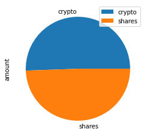
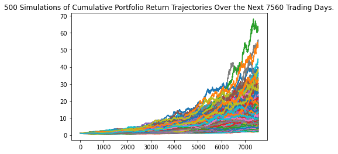
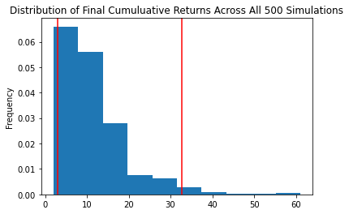

# Unit 5 - Financial Planning #


##  The Chief Technology Officer (CTO) of the credit union asked you to develop a prototype application to demo in the next credit union assembly. ##
## The credit union board wants to allow the union's members to assess their monthly personal finances, and also be able to forecast a reasonably good retirement plan based on cryptocurrencies, stocks, and bonds. ##
## The two tools created are firstly, a personal finance planner that will allow users to visualize their savings composed by investments in shares and cryptocurrencies to assess if they have enough money as an emergency fund. Secondly, a retirement planning tool that will collate historical closing prices for a retirement portfolio composed of stocks and bonds, simulations to project the portfolio performance at 30 years. ##

--------

## Technologies

This notebook leverages Python 3.8 with the following packages in a Jupyter Notebook:
- Pandas
- Matplotlib
- alpaca_trade_api 
- MCForecastTools
- dotenv
- matplotlib
- requests
---

## Installation Guide

Before running the notebook, please install the dependencies:

```python
pip install pandas
pip install alpaca_trade_api
pip install matplotlib
pip install requests
pip install dotenv

```

---

## Observations

# Part 1 - Personal Finance Planner #

## Collect Crypto Prices Using the requests Library ##
### The current portfolio value of cryptocurrencies ###
### Are your 1.2 BTC is worth $40311.00. ###
### The current value of your 5.3 ETH is $2996.16. ### 

## Collect Investments Data Using Alpaca: SPY (stocks) and AGG (bonds) ##
### The value in dollars of the current amount of shares ###
### The current value of your 200 AGG bonds is $23638.00 ###
### The current value of your 50 SPY shares is $18694.00 ###

## Savings Health Analysis ##



### Your total amount of saving is $85639.16. Congratulations! you have enough money in your emergency fund ###

# Part 2 - Retirement Planning #
## Monte Carlo Simulation plots 30years






## Retirement Analysis ##

### There is a 95% chance that an initial investment of $20000 ###
### in the portfolio over the next 30 years will end within in the range of $59650.05 and $654677.73 ###


# Optional Challenge - Early Retirement # 
## Five Years Retirement Option ##

### There is a 95% chance that an initial investment of $60000 ###
### in the portfolio over the next 5 years will end within in the range of $51039.77 and $136657.68 ###

## Ten Years Retirement Option ##
### There is a 95% chance that an initial investment of $60000 ###
### in the portfolio over the next 10 years will end within in the range of $60760.85 and $295346.49 ###
 
---

## Contributors

By: Roy Booker

---

## License

MIT